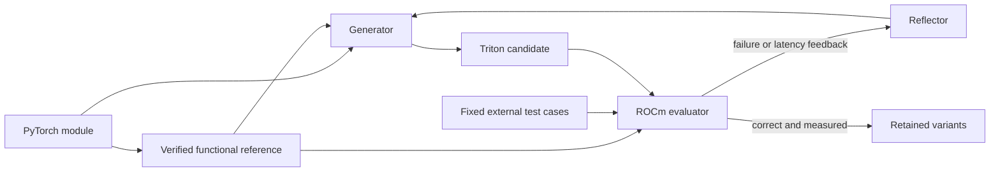

# TritonKernelGen

This package implements the construction workflow in
[AMDKernelVault Section 3.1](https://arxiv.org/html/2609.12471#S3.SS1).
It generates Triton kernels from PyTorch references, checks AMD execution, and uses failure or latency feedback for further attempts.

The package contains code, prompts, tests, and a container recipe.
Source datasets, reference kernels, test-case collections, and generated outputs remain external.



Stage 1 uses an external standardized reference, which this package revalidates before contacting a model.
The existing [`torch_modu2func_kit`](../hip-kernel-generator/torch_modu2func_kit/README.md) can produce that reference.
Stage 2 keeps the accepted reference, tests, and tolerances fixed while changing the Triton candidate.

## Paper settings and release boundaries

| Component | Behavior |
| --- | --- |
| Generation models | Configurable endpoints for GPT-oss-120B, DeepSeek-R1, or Qwen2.5-32B |
| Compiler | Triton 3.3.0 with a ROCm PyTorch runtime |
| AMD targets | `gfx942` and `gfx950`, checked against the selected device |
| Correctness | Task-specific tolerances, otherwise `rtol=1e-4`, `atol=1e-3`, `equal_nan=False` |
| Cases | External, fixed correctness and performance suites; actual counts and configurations are recorded |
| Paper coverage | Approximately ten correctness configurations and three performance configurations per kernel |
| Timing | 25 ms warmup and 100 ms measurement budgets through Triton `do_bench`, reporting the median |
| Attempts | Explicit caller budget; the paper gives no fixed construction attempt count |
| Retention | Correct, measured candidates can be retained even when slower than the baseline |

The three-turn RL setting does not determine this construction budget.
The model-family option records the caller's selection.
The requested and returned service model identifiers remain in the run records.
Verify which checkpoint your inference endpoint serves.

The paper does not specify exact callable names, seeds, case shapes, or a single Docker image.
[PAPER_ALIGNMENT.md](PAPER_ALIGNMENT.md) distinguishes its reported settings from release interface choices.

## 1. Prepare the runtime

Use an existing ROCm environment with PyTorch, NumPy, and Triton 3.3.0, then install this package:

```bash
python -m pip install -e ./triton-kernel-generator
```

Alternatively, build the provided container from this directory:

```bash
docker build -f docker/Dockerfile -t amdkernelvault-triton-kernelgen:local .
```

The recipe pins a ROCm base and the official `torch==2.7.0+rocm6.3` / `pytorch-triton-rocm==3.3.0` wheel pair.
It defines a release environment, not the exact historical experiment image.
Validate its GPU support on the target host.
For `gfx950`, use a ROCm/PyTorch build that supports that architecture while retaining Triton 3.3.0.
The worker checks runtime versions and the selected device before generation starts.

Run generated code in a disposable, restricted GPU environment without valuable host files or long-lived credentials.
Subprocess timeouts and environment filtering do not provide a hostile-code security boundary.

## 2. Supply the module, reference, and fixed cases

The original module exports `Model`.
The standardized reference exports `module_fn` and a `Model.forward(..., fn=...)` wrapper.
The wrapper binds arguments and model state, calls `fn` once, and directly returns its result.
Computation belongs inside `module_fn`.

Supply a separate Python case provider with this interface:

```python
def get_cases(task_id, module, *, kind):
    # Return or yield trusted Case objects for this task.
    # kind is "correctness" or "performance".
    ...
```

The public `triton_kernel_gen.Case` type holds the case ID, constructor arguments, call arguments, and optional tolerance overrides.
See [PROTOCOL.md](PROTOCOL.md) for its exact fields and supported values.
Use inherited and independently validated probes spanning relevant shapes, strides, dtypes, and boundary conditions.
The generator does not create new tests or reduce the suite after failures.

The reference checks cover original outputs, functional outputs, injected calls, and seeded replay.
The verifier freezes input values before candidate generation.
Cases must be read-only and deterministic under the recorded seed.
Case counts alone do not prove generalization.

## 3. Inspect one construction run

Set `SERVED_MODEL` to your endpoint's exact model identifier.
Set `GENERATION_ATTEMPTS` to the code-generation budget for the task.
Optional authentication uses `TRITON_GEN_API_KEY` from the environment.

```bash
triton-kernelgen \
  --module /inputs/original.py \
  --functional /inputs/functional.py \
  --case-provider /inputs/cases.py \
  --task-id operator_name \
  --endpoint http://model-host:8000/v1/chat/completions \
  --model-family gpt-oss-120b \
  --model-id "$SERVED_MODEL" \
  --max-attempts "$GENERATION_ATTEMPTS" \
  --gpu 0 --target-arch gfx942 \
  --output-dir /output/kernels \
  --artifacts-dir /output/artifacts \
  --dry-run
```

The preview checks paths and settings without importing task code or contacting the endpoint.
Remove `--dry-run` to validate the reference and start generation.
Each attempt contains one generation request.
A separate reflection request runs only when another generation can follow.
The upper request bound is `2 * max_attempts - 1` per task, without provider retries.

The default retains the first valid, measured candidate.
Use `--num-variants N` to collect additional distinct candidates within the same total budget.
Later prompts can use performance feedback when seeking another variant.
Raw responses, reasoning, prompts, reflection text, and verification evidence remain in the artifacts.

## 4. Run inside the container

Mount external inputs read-only.
Use a separate writable output directory:

```bash
bash scripts/run_container.sh \
  --image amdkernelvault-triton-kernelgen:local \
  --inputs /absolute/path/to/inputs \
  --output /absolute/path/to/output \
  -- \
  --manifest /inputs/tasks.json \
  --endpoint http://model-host:8000/v1/chat/completions \
  --model-family gpt-oss-120b \
  --model-id "$SERVED_MODEL" \
  --max-attempts "$GENERATION_ATTEMPTS" \
  --gpu 0 --target-arch gfx942 \
  --output-dir /output/kernels \
  --artifacts-dir /output/artifacts
```

If the endpoint requires authentication, add `--api-key-env TRITON_GEN_API_KEY` before the separator.
The launcher passes the named environment variable without embedding its value in the command.
Use one generator process per allocated GPU.
Use separate manifest shards to scale across workers.

## 5. Port or optimize an existing Triton source

`--seed-kernel` supplies source context that can contain CUDA-specific or currently invalid code.
The verifier never executes that raw seed.

`--baseline-kernel` requests a validated Triton timing baseline for optimization.
It must pass the same AMD cases before generation begins.
Both options can be used together when the context and validated baseline differ.
The PyTorch reference remains the correctness oracle.

## Records and validation

Each task run creates a unique record directory.
Accepted kernels use immutable content hashes in their output paths.
Repeated runs preserve earlier records and verify new candidates again.
Records retain source fingerprints, declared dependencies, actual cases, GPU/runtime information, and per-case latency measurements.
Infrastructure failures remain distinct from candidate compilation or correctness failures.

Install CPU test dependencies in a separate development environment:

```bash
python -m pip install -e '.[test,dev]'
python -m pip install torch==2.7.1+cpu --index-url https://download.pytorch.org/whl/cpu
python -m pytest -q
ruff check src tests
```

These tests exercise orchestration, references, layouts, parsers, and subprocess contracts with mocked GPU boundaries.
They do not establish GPU performance, live model behavior, or reproduction of the historical corpus.
